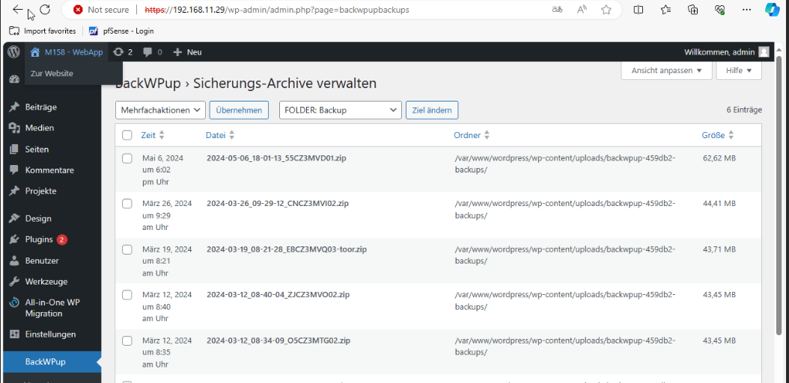

## Ein Datei- und Datenbank-Backup ist Serverseitig eingerichtet

Das Plugin BackWPup, das bereits auf dem Legacy-Server installiert war, haben wir auch auf unserer Wordpress-Seite integriert und einen Job konfiguriert, der regelmäßig ausgeführt wird. Dadurch erfolgt in regelmäßigen Abständen eine Sicherung der gesamten Webseite und Datenbank.

Aktuell wird dieses Backup auf dem Server selbst gespeichert. Es wäre jedoch wünschenswert, diese Sicherungsdatei zukünftig direkt an einem anderen Ort abzulegen.

