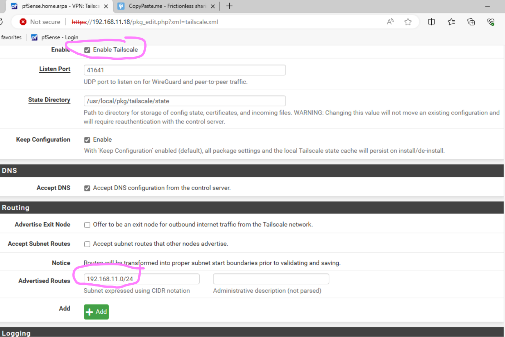

# Tailscale Installation

1. **PfSense Firewall Installation & Konfiguration:**  
   - Wir installieren und konfigurieren eine PfSense Firewall. In unserem Fall haben wir ein **WAN** Netz und ein **LAN** Netz.
     - WAN = DHCP
     - LAN = 192.168.11.18/24 (Subnetz 11 ist unseres)

2. Melden Sie sich im Web-GUI an (IP-Adresse).

3. Navigieren Sie zu **System** --> **Package Manager** --> **Available Packages** und suchen Sie nach **Tailscale**. Klicken Sie auf **Install** und bestätigen Sie anschließend.

4. Gehen Sie zu **VPN** --> **Tailscale** --> **Settings** (siehe Screenshot) 

5. Besuchen Sie die [Tailscale Webseite](https://tailscale.com/download) und laden Sie die Anwendung für Windows herunter.

6. Melden Sie sich in der Tailscale App unten rechts an.

7. Gehen Sie zur Admin-Konsole.

8. Generieren Sie einen Authentifizierungsschlüssel.

9. Hinterlegen Sie den Authentifizierungsschlüssel in Tailscale.

10. Erlauben Sie das Subnetz in Tailscale.