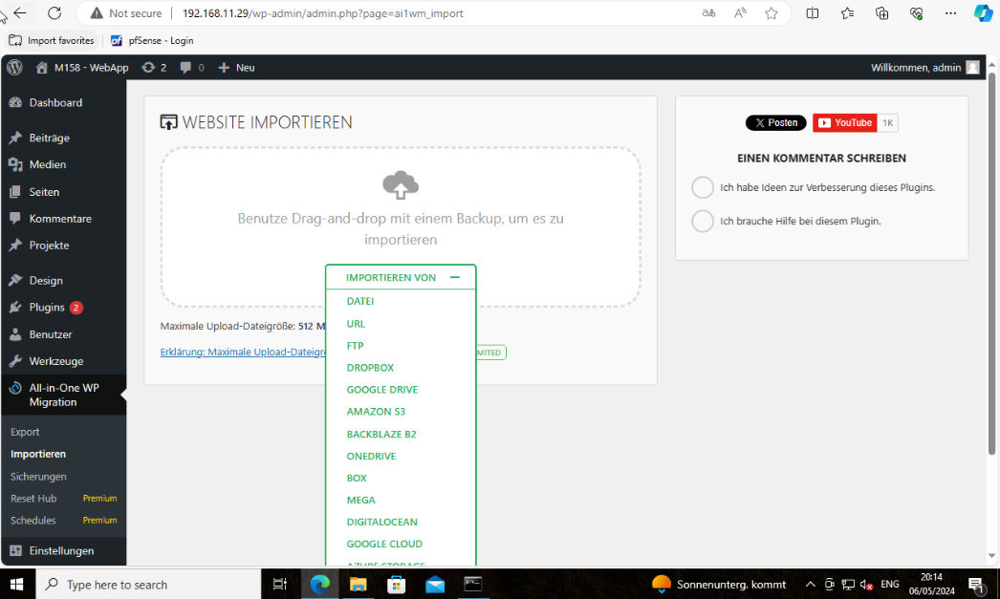

## Es wurde ein Webserver eingerichtet
Wir haben uns beim Webserver für den Apache2 entschieden. Wie bereites unter Punkt: Ein Datenbankserver wurde auf Linux erfolgreich installiert und konfiguriert diverse Packete installiert unter anderem Apache2.
Mittels folgenden Befehlen erstellen wir einen Orfdner /srv/www und legen die Standard-Wordpress-Installation in dieser Location ab:

sudo mkdir -p /srv/www
sudo chown www-data: /srv/www
curl https://wordpress.org/latest.tar.gz | sudo -u www-data tar zx -C /srv/www

Wir haben eine neue vhost-File im Ordner /etc/apache2/sites-available/ erstellt (wordpress.conf), in dieser haben wir unsere Domain definiert, um später via HTTP auf Wordpress zugreifen zu können. Als DocumentRoot haben wir /srv/www/wordpress definiert. In diesem Ordner werden wir Wordpress installieren.

<VirtualHost *:80>
    ServerName wp-toor.m158.etlas.one
    ServerAlias ipv6.wp-toor.m158.etlas.one
    DocumentRoot /srv/www/wordpress
    <Directory /srv/www/wordpress>
        Options FollowSymLinks
        AllowOverride Limit Options FileInfo
        DirectoryIndex index.php
        Require all granted
    </Directory>
    <Directory /srv/www/wordpress/wp-content>
        Options FollowSymLinks
        Require all granted
    </Directory>
</VirtualHost>

Mittels sudo a2ensite wordpress wurde die Webseite aktiviert.
Nun konnte mit Aufruf unserer Domain, mittels dem Wordpress Wizard eine Standard-Installation durchgeführt werden. Da später durch unser Plugin (Die Datenbank von der Quellinstallation wurde migriert) sowieso unsere gesamte Wordpress Seite durch den Export der Legacy Seite ersetzt wird, spielt hier die genaue Konfiguratoion abgesehen von den Datenbank-Credentials keine grosse Rolle.
Um den Upload der Export-datei von unserem Legacy Server via dem erwähnten Plugin auf unseren neuen Server zu ermöglichen, mussten noch einige Konfigurationen hinsichtlich maximale Upload-Grösse angepasst werden. Alsbald dies erfolgt ist, kann die Sicherungsdatei vom Legacy Server via demselben Plugin auf unseren neuen Server hochgeladen werden und das Plugin erledigt sämtliche Migrationsarbeiten.
In der .htaccess File:

php_value upload_max_filesize 512M                                                                                      php_value post_max_size 512M                                                                                            php_value memory_limit 512M                                                                                             php_value max_execution_time 300                                                                                        php_value max_input_time 300  

In der wp-config.php File:

@ini_set( 'upload_max_filesize' , '512M' );                                                                             @ini_set( 'post_max_size', '512M');                                                                                     @ini_set( 'memory_limit', '512M' );                                                                                     @ini_set( 'max_execution_time', '300' );                                                                                @ini_set( 'max_input_time', '300' );  

## Webserver läuft unter einem virtuellen Host Ihrer Wahl
Unter Apache2 wird immer auf "virtuelle Hosts" bzw. "vhosts" zurückgegriffen. Im Ordner /etc/apache2/sites-available/ legen wir .conf Dateien ab, in welchen wir auf unserem Webserver mehrere Domains und jeweils eigene Root-Verzeichnisse definieren können. Auf unserem Webserver finden sich aktuell zwei vhost Dateien, eine für unsere Wordpress Seite unter Port 80 via HTTP und eine für diesselbe Wordpress Seite unter derselben Domain aber unter Port 443 und somit erreichbar via HTTPS.

## HTTP wird auf HTTPS umgeleitet mit einem selbst signiertem Zertifikat
Anstelle eines selbst signierten Zertifikats wurde ein Zertifikat verwendet, welches automatisiert von Let's Encrypt ausgestellt wurde. (siehe Punkt Website ist mit TLS Zertifikat von Let's Encrypt ausgestattet)
In der Virtual Host File für Wordpress unter Apache2 (/etc/apache2/sites-available/wordpress.conf) legen wir die Domains fest, unter welcher unsere Wordpress Seite erreichbar sein soll. Als Alias auch unsere ipv6-only Domain. Certbot wird später nach der Erstellung des TLS-Zertifikats automatisch einen Redirect von HTTP auf HTTPS einrichten. Manuell könnte dies selbstverständlich auch vorgenommen werden (ebenfalls in dieser wordpress.conf Datei).
