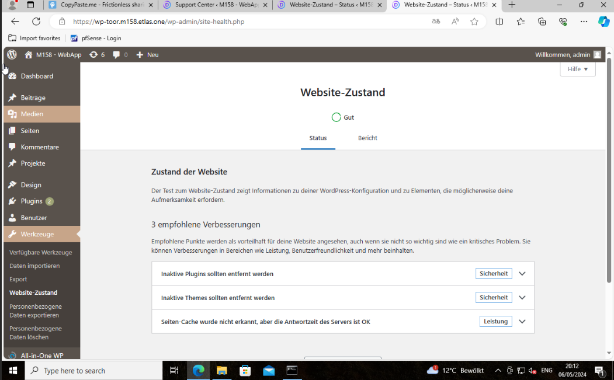

## Die Website sieht optisch identisch wie die Quellapplikation aus und zeigt keine Fehlermeldungen an

## Die Seite https://tanjiro.cloud/wp-admin/site-health.php zeigt keine Fehler

## Die Seite https://tanjiro.cloud/wp-admin/admin.php?page=et_support_center_divi zeigt keine Fehler auf

