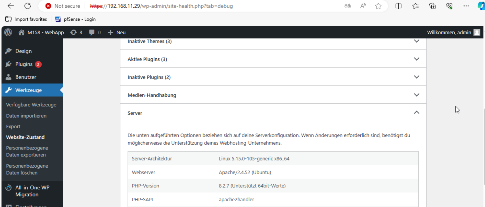
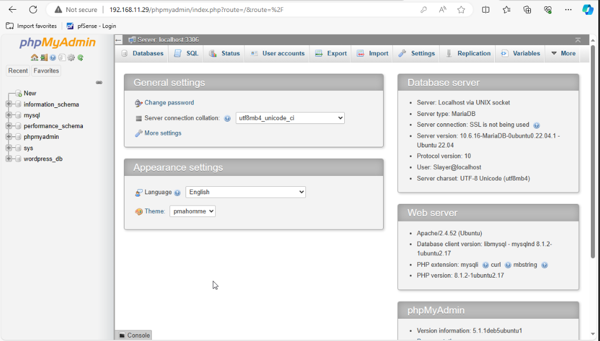

## Installation und Aktivierung von PHP

PHP 8.2 wurde aus den Standard-Ubuntu-Paketquellen installiert und entsprechend unter Apache2 aktiviert:

```bash
sudo apt install php8.2 
sudo apt install php8.2-mysql php8.2-bcmath php8.2-curl php8.2-imagick php8.2-dom php8.2-zip php8.2-intl
a2dismod php8.1
sudo a2enmod php8.2
```

## Verwendung von PHP Version 8.2

Siehe Abschnitt zur PHP-Installation.



## phpMyAdmin

